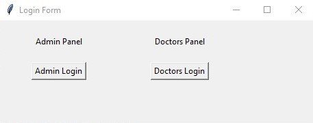
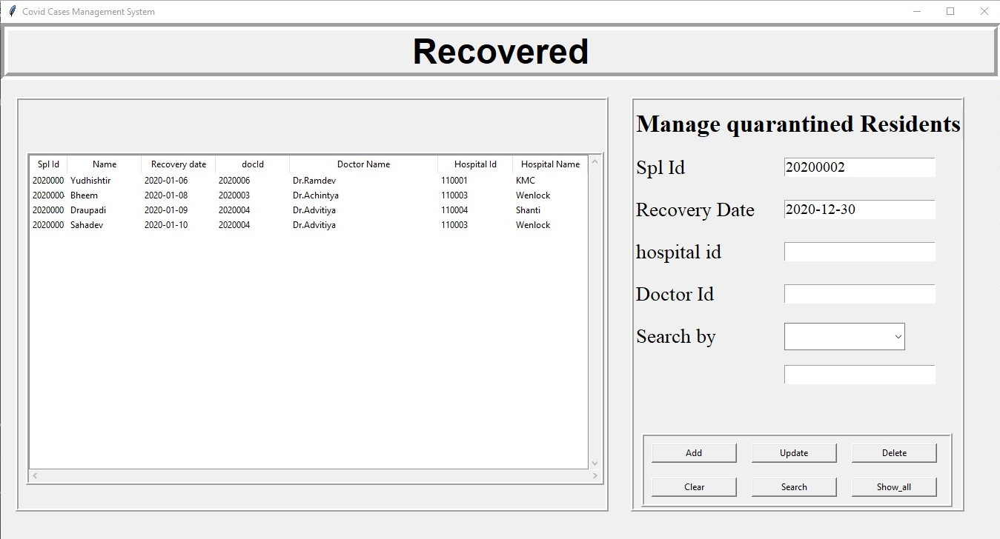
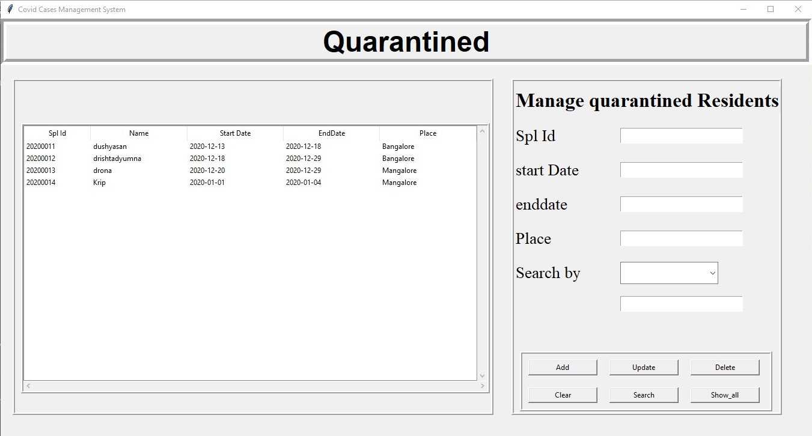
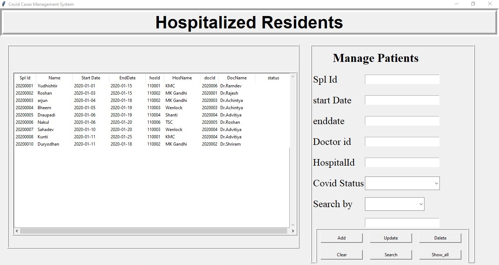
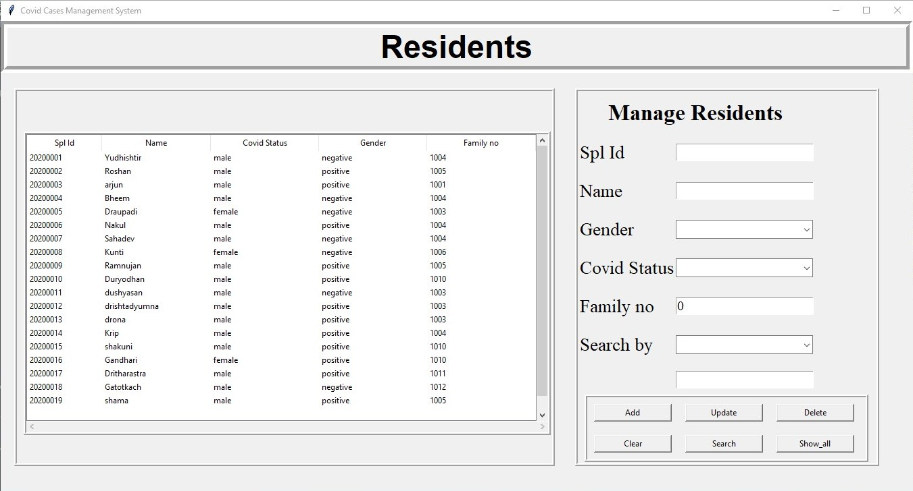
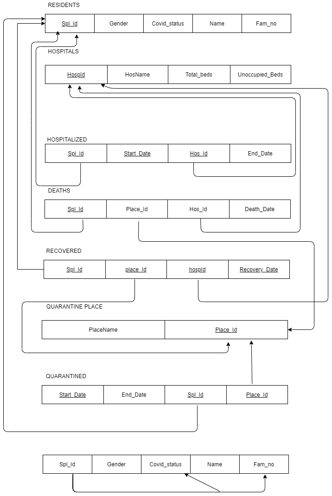

# CovidCaseManagementSystem
A simple DBMS project to manage covid-cases in technologically deprived areas.built using (python and MySQL)
# ScreenShots
| | |
|---|---|
|Login Window|User Choice Window|
| ||
|||
| ||
|||
| ||
|||
| ||
|Er Diagram|Schema Diagram|
| ||
